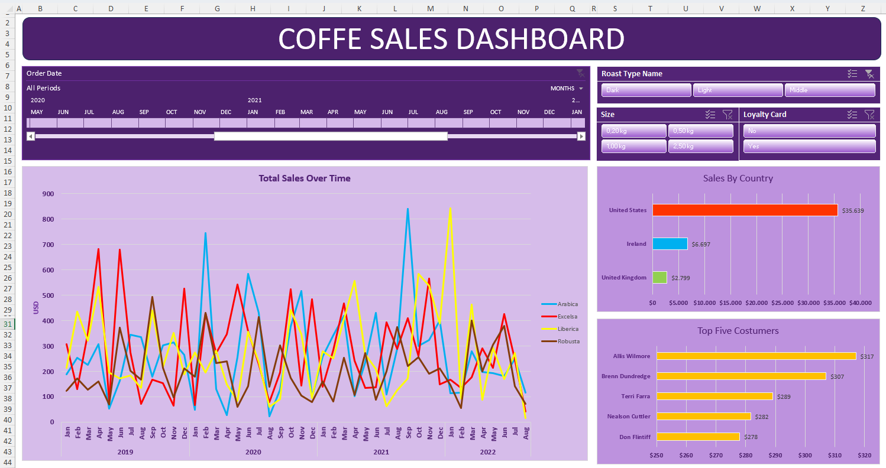
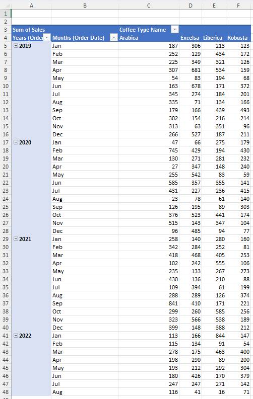
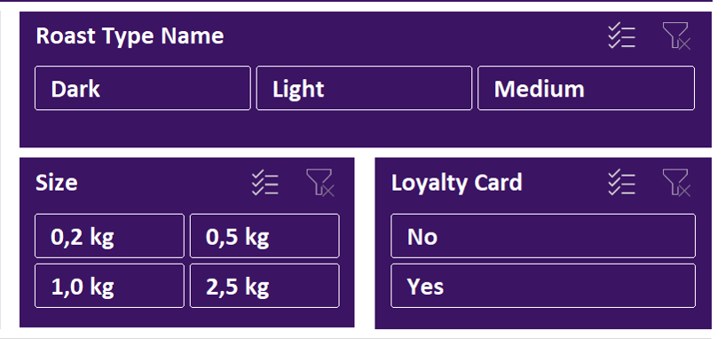
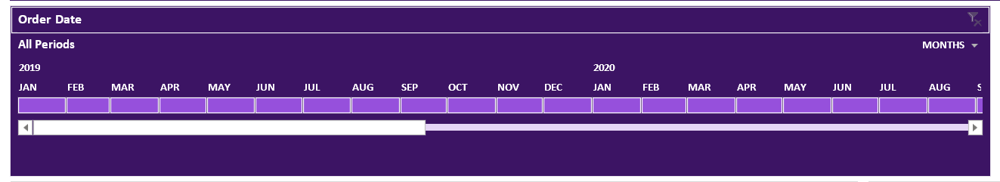

📘 README.md — Coffee Orders Dashboard Project
📊 Coffee Orders Dashboard — Portfolio Project

Dashboard interattiva in Excel progettata per analizzare ordini di caffè su più dimensioni (tipo di prodotto, data, quantità, punto vendita).
Il progetto simula un caso reale: raccolta dati, cleaning, organizzazione delle tabelle, creazione di pivot tables e costruzione di un pannello manageriale con KPI, grafici dinamici e slicer interattivi.

🎯 Obiettivi

- Costruire una dashboard Excel chiara, pulita e immediata

- Applicare tecniche di data cleaning su dati reali

- Creare una struttura di dataset “raw → cleaned → dashboard” come si fa nei team data

- Usare strumenti avanzati di Excel per analisi e visualizzazione

- Presentare un progetto replicabile per portfolio GitHub / LinkedIn

🛠️ Tecniche e strumenti utilizzati

- XLOOKUP per estrarre dati correlati

- INDEX + MATCH per lookup più complessi

- Tabelle dinamiche (CTRL+T) come data source strutturato

- PivotTables sincronizzate e indipendenti

- Slicer e Timeline collegati tramite Report Connections

- Formati personalizzati per KPI (quantità, prezzi, categorie)

- Grafici dinamici per trend e distribuzioni

- Data cleaning: rimozione duplicati, formattazione colonne, normalizzazione tipi dati

📂 Struttura del repository

project-folder/
│
├─ data/
│   ├─ raw/
│   │    └─ RawData_coffeeOrders.xlsx
│   └─ cleaned/
│        └─ CleanedData_&_Dashboard_coffeeOrders.xlsx
│
├─ dashboard/
│   ├─ Cleaned_Data_&_Dashboard_coffeeOrdersData.xlsx  (file finale della dashboard)
│   └─ screenshots/
│       ├─ dashboard.png
│       ├─ pivots_table.png
│       └─ slicers.png
│       └─ timeline.png
│
└─ README.md

## 🖼️ Screenshot della Dashboard

### Dashboard completa

### Pivot Tables (dettaglio)

### Slicers (dettaglio)

### Timeline (dettaglio)

📥 File del progetto

Scarica il file Excel completo:
/dashboard/Cleaned_Data_&_Dashboard_coffeeOrdersData.xlsx

📌 Cosa dimostra questo progetto

Capacità di pulire, organizzare e documentare dataset

Costruzione di dashboard aziendali con KPI immediati

Conoscenza avanzata di PivotTables e Slicer

Attenzione alla struttura del progetto (tipica dei ruoli data)

Capacità di presentare il lavoro in modo professionale per recruiter e tecnici

📎 Contatti

LinkedIn: [https://www.linkedin.com/in/fokou-alex-679014212/]
Email: [teddyalex.fokou@mail.polimi.it]
